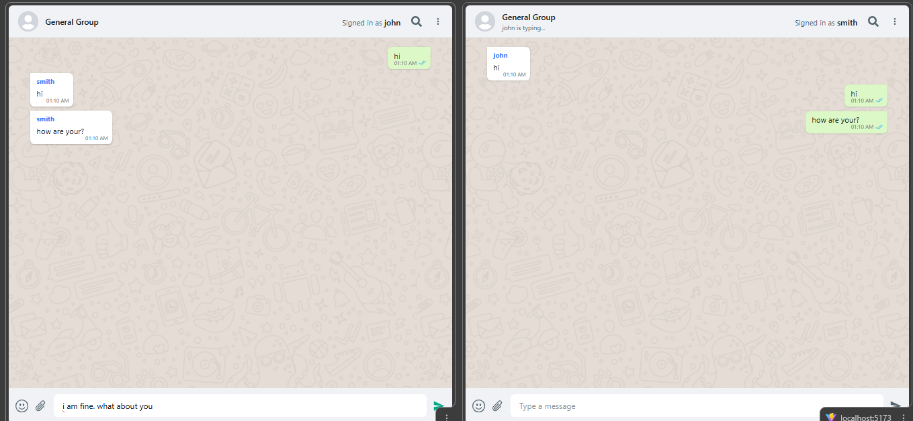

# Real-Time Chat Application 💬

A real-time messaging application built with **React, Node.js** and **Socket.io** for seamless bi-directional communication.

## 🚀 Features

- **Real-Time Messaging**: Instant delivery of messages using WebSockets via [Socket.io](https://socket.io/).
- **Group Chat**: Centralized room for all connected users.
- **Typing Indicators**: Live "User is typing..." updates to enhance the conversational feel.
- **Responsive UI**: WhatsApp-inspired design styled with [Tailwind CSS](https://tailwindcss.com).

## 📸 Screenshots

| Chat Interface                       |
| ------------------------------------ |
|  |

## 🛠️ Tech Stack

- **Frontend**: [React.js](https://react.dev), Tailwind CSS, React Icons.
- **Backend**: [Node.js](https://nodejs.org), [Express](https://expressjs.com).
- **Communication**: [Socket.io](https://socket.io/get-started/chat/) for real-time events.

## 📦 Getting Started

### Installation

1. **Clone the repository**

   ```bash
   git clone https://github.com/rupeshpatil27/socket-io-chat.git
   cd socket-io-chat
   ```

2. **Setup Server**

   ```bash
   cd server
   npm install
   node index.js
   ```

3. **Setup Client**
   ```bash
   cd client
   npm install
   npm run dev
   ```
